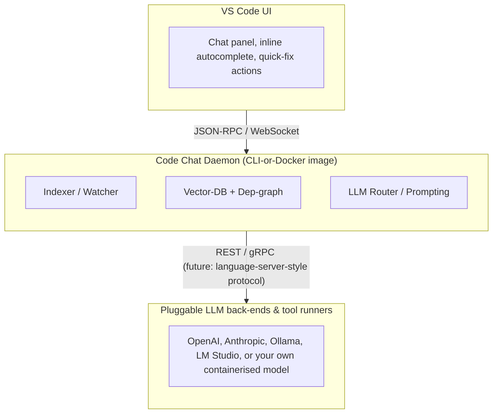

# CodeChat
Integrate multi LLM with your code locally, and integrate that with CLI and VS Code

# High-level Architecture

```
# Folder Layout
.
│   .dockerignore
│   Dockerfile
│   LICENSE
│   README.md
│
├───.github
│   └───workflows
├───daemon
│   │   poetry.lock
│   │   pyproject.toml
│   │
│   └───codechat
│           __init__.py
│
├───scripts
│       dev‑alias.sh
│       doctor.sh
│
└───vscode-extension
```
