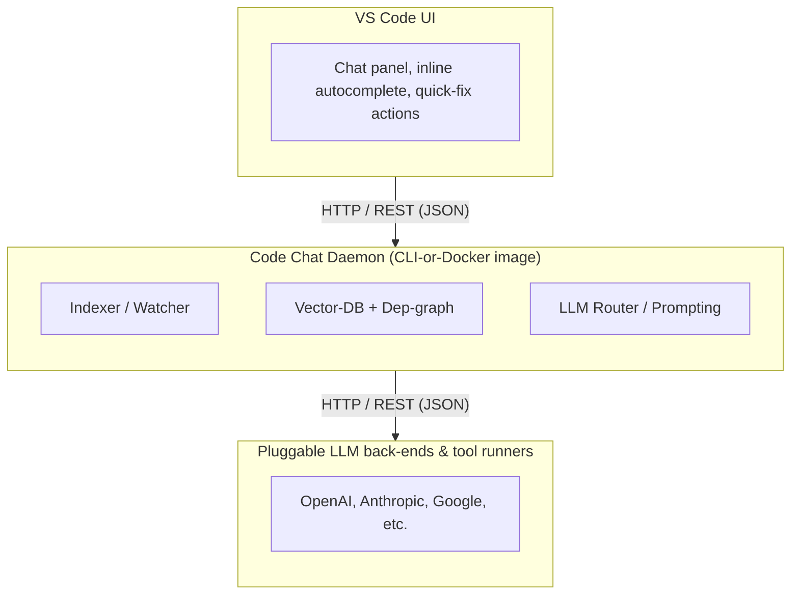

# CodeChat
Integrate multi LLM with your code locally, and integrate that with CLI and VS Code

# High-level Architecture

# Local Build and Install

See [docs/InstallingRunCodeChat.md](docs/InstallingRunCodeChat.md)

# VS Code Extension

See [docs/VS-Code-Extension.md](docs/VS-Code-Extension.md)